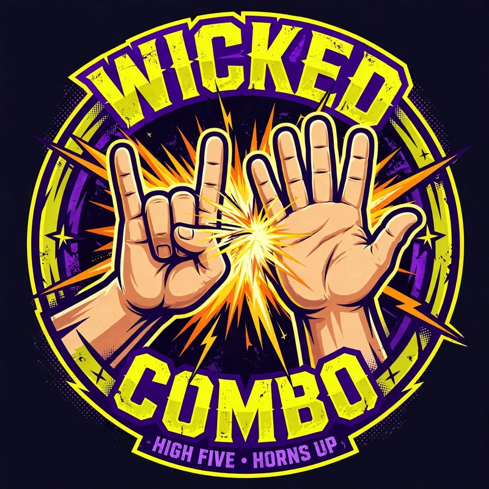

# Wicked Combo

WICKED COMBO

High five &middot; Horns up

Wicked Combo is an independent game studio making serious tactical games. When your tactics land with a devastating blow &mdash; that's a Wicked Combo.

<h2>OUR GAMES</h2>
<a class="wc-game" href="https://sanguisharena.com/">

<h3>Sanguis et Harena</h3>

<em>A tactical card game of timing, positioning, and nerve.</em>

Gladiatorial combat for 2&ndash;6 players. Draft a champion, assemble your loadout, and outthink your opponents &mdash; six seconds at a time.

Visit sanguisharena.com &rarr;

</a>

<h2>THE STUDIO</h2>

Wicked Combo designs games where every decision matters and every play tells a story. Sanguis et Harena is our first release &mdash; more are in the arena.

Wicked Combo is a wholly owned subsidiary of Mark Davis Holdings, LLC. &copy; 2026 Wicked Combo. All rights reserved.

